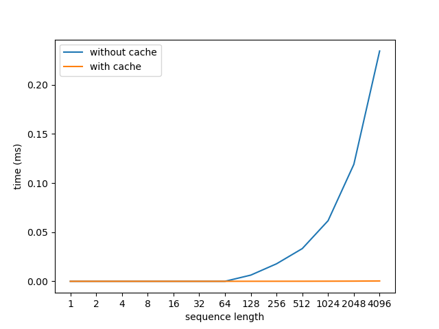

# LLM Simulator with Cache

## Radix Tree

The `RadixTree` class implements a radix tree based on a tokenizer and the generated tokens.

We use [`tiktoken`](https://github.com/openai/tiktoken) as the default tokenizer, which can be installed with
```
pip install tiktoken
```

The tree is built using `TreeNode`s. Each `TreeNode` contains 
* `token` that this node stores
* `keys` and `vals` that stores the corresponding kv cache
* `child`, a dictionary that maps the next token to its corresponding node.

The class provides `get` and `insert` function to look up and insert prompts.

## Timing Based Simulator

The simulator simulates the generation by sleeping for a certain amount of time. This sleeping time is proportional to prompt length and time per token can be set with `set_config` function.  And then each simulation is done by calling the `generate` function.

## Integration

We also integrate the radix tree into the simulator. The simulator runs simulation with prefix caching when `enable_caching` is set to be `True`. 

With caching, the simulator checks the cache before the prefill phase. If the prompt is in the radix tree, it directly gets the key and value matrices from the radix tree and skips the prefilling.

## Benchmarking

We vary the prompt length and compared the latency with and without caching. The prefill time per token is set to be 0.25 ms (same as SARATHI's measurement in Fig 3).

The measured result is shown below.



In both cases, the time increases as the sequence length increases. However, if there's no caching, the time increases much faster.

## Tradeoffs

According to the comparison of the simulated latency, using cache reduces the prefill time especially when the prompt sequence is longer.

However, if too many prompts are cached, the cache lookup time might also increase.